  

Hey, I'm Hanzala 👋

- I build RAG and agentic systems that survive real users, not just demos
- The part I love is what happens after the notebook: evals, guardrails, observability
- Full-stack, so I ship the whole thing: retrieval, orchestration, backend, and UI
- Based in Dresden 🇩🇪, open to new roles

### What I'm into right now

- **Harness & loop engineering** for long-horizon agents, pushing LangGraph further
- **AI governance**: evals, model auditing, and gating deploys on quality, not vibes
- **AI-assisted development**: Claude Code is my daily driver for shipping real code

### Tech stack

| | |
|---|---|
| **Languages** |  |
| **AI / LLM** |  |
| **Backend** |  |
| **Frontend** |  |
| **DevOps** |  |
| **AI Dev Tools** |  |

### Stats

  
  

### Connect

  
  
  
  

